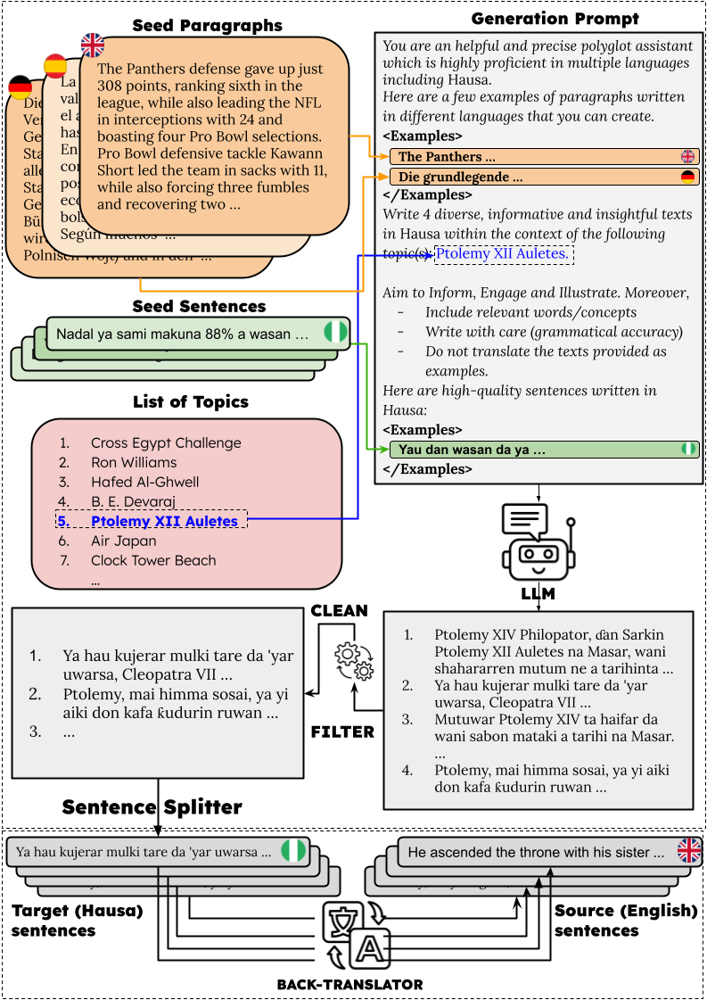

# Official Repo of TopXGen

Official implementation of [TopXGen: Topic-Diverse Parallel Data Generation for Low-Resource Machine Translation]() with code, prompts and model outputs.



# Table of Contents

1. [Overview of TopXGen](#overview)
2. [Installation](#installation)
3. [Experiments](#experiments)
    - 3.1 [Dataset Generation](#dataset-generation)
    - 3.2 [Decontamination](#decontamination)
    - 3.3 [Dataset Description](#dataset-description)
    - 3.4 [Training](#training)
    - 3.5 [Evaluation](#evaluation)
    - 3.6 [Ablation studies](#ablations-studies)
4. [Contributions](#contributions)
5. [Aknowledgements](#aknowledgements)
6. [Citations](#citations)

# Overview

We propose to generate a parallel datasets by leveraging language models. Given a target language, we can prompt a generator **G** to get generate paragraphs on a range of topics. The obtained paragraphs are then splitted into sentences and cleaned to obtain a sentence-level monolingual dataset. A back-translator **BT** is then used to [back-]translate those sentences into a source language of interest (typically a high-resource language such as English). Given the generated dataset, which we term as *TopXGen* dataset, you can train a small LM (e.g. LLaMA 2 7B, LLaMA 3 8B, GEMMA 3 4B PT) to perform MT between the source language and the languages generated. You can also used it as a selection pool for In-Context Learning.

# Installation

This repository relies on [vLLM](https://github.com/vllm-project/vllm) and [Transformers](https://github.com/huggingface/transformers). It also supports Cohere and OpenAI models via their respective API.

Before using this repository, make sure to install [PyTorch](https://pytorch.org/get-started/locally/) in accordance to the characteristics of your device. The rest of the required libraries can be installed via

```
git clone https://github.com/ArmelRandy/topxgen
cd topxgen/
pip install -r requirements.txt
```

In case you want to use [SONAR](https://github.com/facebookresearch/SONAR) and/or [BLASER](https://huggingface.co/facebook/blaser-2.0-qe), you will need to do `pip install sonar-space`. Feel free to refer to SONAR's repository for more information.

You might also require [FlashInfer](https://github.com/flashinfer-ai/flashinfer) (`pip install flashinfer==0.1.2 -i https://flashinfer.ai/whl/cu121/torch2.3`) if you work with Gemma models and [Flash Attention](https://github.com/Dao-AILab/flash-attention) (`MAX_JOBS=4 pip install flash-attn --no-build-isolation  --no-cache-dir`) for fast inference. Recent versions of vllm might need slight modifications to allow beam search.

# Experiments

## Dataset Generation

In the paper, we use [gemma-3-27b-it](https://huggingface.co/google/gemma-3-27b-it) to generate paragraphs into 10 languages: Basque, Hausa, Igbo, Kinyarwanda, Nepali, Somali, Sundanese, Swahili, Urdu and Xhosa. It is possible to control the generation parameters (temperature, top_p, repetition penalty etc.) and how the generation prompts are constructed. Our dataset is available [here](https://huggingface.co/datasets/almanach/topxgen-gemma-3-27b-and-nllb-3.3b). You can use the following command to generate your own dataset:

```bash
python\
    --data_generation_pipeline topxgen\
    --model_name_or_path google/gemma-3-27b-it\
    --tokenizer_name_or_path google/gemma-3-27b-it\
    --inference_api vllm\
    --api_key <YOUR_API_KEY>\ # If required
    --request_batch_size 128\
    --seed 122\
    --max_new_tokens 2000\
    --temperature 1.0\
    --top_p 1.0\
    --repetition_penalty 1.0\
    --num_return_sequences 1\
    --num_beams 1\
    --verbose\
    --languages Basque Hausa Igbo Kinyarwanda Nepali Somali Sundanese Swahili Urdu Xhosa\
    --seed_topics_path /path/to/topxgen/topics/wikipedia_train_topics.txt\ # One topic per line
    --output_dir /path/to/topxgen/data/wiki/gemma-3-27b-it/T=1.0\
    --number_of_instructions 200\
    --number_of_icl_demonstrations 8\
    --number_of_icl_phrases 4\
    --number_of_generations_per_step 2\
    --do_sample\
    --max_samples 10000\
    --number_of_demonstrations 5\
    --use_nllb\
    --nllb_name_or_path facebook/nllb-200-3.3B\
    datagen.py
```

`--number_of_icl_demonstrations` indicates the number of example paragraphs in the generation prompt, `--number_of_icl_phrases` is the number of example sentences in the generation prompt and `--number_of_generations_per_step` the number of paragraphs to generate per prompt. `--number_of_instructions` serves as a stopping criterion, indicating the maximum number of paragraphs to generate.

`--use_nllb` indicates that we will [back-]translate (in `--target_language`) the sentences extracted from paragraphs with a NLLB-based model whose path is given by `--nllb_name_or_path`. Otherwise, the sentences are [back-]translated with the **Generator** in $k$-shot (k $\rightarrow$ `--number_of_demonstrations`) with FLORES-200 dev set as the selection pool. The name of folder where the back-translations are stored can be set using `--translate_dir`, by default it is `back_translator.split("/")[-1]$`.

## Decontamination

Our decontamination procedure is largely inspired by [cosmopedia](https://github.com/huggingface/cosmopedia/tree/main/decontamination). We decontaminate our datasets against the validation and test sets of [FLORES-200](https://huggingface.co/datasets/facebook/flores), [TICO-19](https://tico-19.github.io) and [NTREX 128](https://aclanthology.org/2022.sumeval-1.4/). 

## Dataset Description

The datasets generated for this work are stored in the [data/wiki](data/wiki/) folder. Each directory corresponds to a generator (i.e. the folder [data/wiki/gemma-3-27b-it](data/wiki/gemma-3-27b-it/) contains data generated with [gemma-3-27b-it](https://huggingface.co/google/gemma-3-27b-it)). In such a folder, we have subfolders corresponding to different data generation pipelines, the one we are interested into is ToPXGen i.e. [data/wiki/gemma-3-27b-it/topxgen](data/wiki/gemma-3-27b-it/topxgen/). The folders inside are organized based on the temperature of the generation and later the back-translator. The main experiments are done with [gemma-3-27b-it](https://huggingface.co/google/gemma-3-27b-it) as the generator, generating data with a temperature T=1.0 that are later [back-]translated by [nllb-200-3.3B](https://huggingface.co/facebook/nllb-200-3.3B). 

- Each `{language}.jsonl` is a collection of paragraphs (one per line) generated by the generator.
- In each `{back-translator}/{language}_translate.jsonl`, a line is a dictionary. `sentence` is the paragraphs, `propositions` is the list of sentences obtained after sentence splitting and `translations` is the list of English translations. We also have `scores` which corresponds to [BLASER scores](https://huggingface.co/facebook/blaser-2.0-qe) between each pair proposition-translation. 
- `{back-translator}/{language}_translate_filtered.jsonl` is obtained after decontamination of the previous one.

## Training

Now that the [TopXGen dataset is cleaned and decontaminated](data/wiki/gemma-3-27b-it/topxgen/T=1.0/nllb-200-3.3B/Basque_translate_filtered.jsonl), it can be used to train a model. We provide the training code in [topxgen/train.py](train.py). It supports decoder-based LMs ([Llama-2-7b](https://huggingface.co/meta-llama/Llama-2-7b-hf), [Llama-3-8b](https://huggingface.co/meta-llama/Meta-Llama-3-8B) etc.) and NLLBs ([NLLB-200-1.3B](facebook/nllb-200-1.3B), [NLLB-200-3.3B](facebook/nllb-200-3.3B) etc.).

```bash
GPUS_PER_NODE=1
accelerate launch\
    --num_processes=$GPUS_PER_NODE\
    train.py\
    --model_name_or_path meta-llama/Meta-Llama-3-8B\
    --tokenizer_name_or_path meta-llama/Meta-Llama-3-8B\
    --dataset_name_or_path topxgen\
    --input_column_name source\
    --output_column_name target\
    --max_length 512\
    --max_steps 5000\
    --per_device_train_batch_size 4\
    --per_device_eval_batch_size 4\
    --gradient_accumulation_steps 4\
    --learning_rate 1e-5\
    --lr_scheduler_type cosine\
    --num_warmup_steps 500\
    --weight_decay 0.01\
    --bf16\
    --seed 122\
    --output_dir checkpoints-llama-3-8b-eus-wiki\
    --reverse\
    --logging_steps 100\
    --eval_steps 200\
    --save_steps 200\
    --src English\
    --target_languages Basque\
    --dataset_size -1\
    --strategy soonest\
    --targets_only\
    --data_dir data/wiki/gemma-3-27b-it/topxgen/T=1.0/nllb-200-3.3B\
    --gradient_checkpointing\
    --test_size_ratio 1000\
    --use_flash_attn\
```

This command helps fine-tuning `Meta-Llama-3-8B` on the full TopXGen dataset except 1000 samples which are used for validation (`--dataset_size -1`, `--test_size_ratio 1000`) to perform MT from English to Basque. Adding `--reverse` trains on the reverse direction too.

If you want to use [peft](https://github.com/huggingface/peft) (e.g. [LoRA](https://arxiv.org/abs/2106.09685)) you will need to specify the following arguments (adapted to your needs and models):

```
    --lora_r 32\
    --lora_alpha 64\
    --lora_dropout 0.05\
    --target_modules q_proj k_proj v_proj o_proj gate_proj up_proj down_proj\
    --use_peft\
```

If you have multiple GPUs, you can use DeepSpeed ZeRO stage 3 via [accelerate](https://huggingface.co/docs/accelerate/usage_guides/deepspeed) by specifying the path to a configuration file.

```
MASTER_PORT=29500
GPUS_PER_NODE=4
CONFIG_FILE="/path/to/topxgen/configs/deepspeed_zero3_multi.yaml"

accelerate launch\
    --main_process_port $MASTER_PORT\
    --config_file $CONFIG_FILE\
    --num_processes=$GPUS_PER_NODE\
    train.py\
```
Our Llama-2-7b- and LLama-3-8b-based models are available on [Hugging Face](https://huggingface.co/collections/almanach/topxgen-689c82e2def790dcdbd74af8)

## Evaluation

We use [Compositional Translation (CompTra)](https://github.com/ArmelRandy/compositional-translation)'s codebase to perform the evaluation of the fine-tuned models. The training is done with [Template 14](comptra/prompts/templates.py#L171) and so should the evaluation ([main.py](main.py)). The evaluation code supports FLORES, NTREX 128 and TICO-19. Here is the code to generate translations with a checkpoint:

```bash
python\
    --model_name_or_path $MODEL_NAME_OR_PATH\
    --tokenizer_name_or_path $TOKENIZER_NAME_OR_PATH\
    --src $SRC\
    --tgt $TGT\
    --request_batch_size 64\
    --inference_api vllm\
    --max_samples 10000\
    --num_return_sequences 1\
    --num_beams 1\
    --max_new_tokens 250\
    --temperature 0.0\
    --top_p 1.0\
    --repetition_penalty 1.0\
    --output_dir GENERATIONS/FLORES/TRAINING/LLAMA-3-8B/REVERSE/GEMMA/T=1.0/GREEDY\
    --k $K\ # Number of ICL demos
    --seed 122\
    --method_divide llm\
    --merge_prompt vanilla\
    --method_translate vanilla\
    --selection_method greedy\
    --steps 0\
    --verbose\
    --number_of_subproblems 0\
    --number_of_refining_steps 0\
    --template_key 14\
    --retriever_type bm25s\
    --dataset_name_or_path flores\
```

If the model was trained with LoRA, the following arguments should be added (the rank should be the same as the one used during training).

```python
    --base_model_name_or_path meta-llama/Meta-Llama-3-8B\
    --lora_rank 32\
    --enable_lora\
```

You can evaluate your model with a command similar to [scripts/eval.sh](scripts/eval.sh)

## Ablations studies

The codebase also supports [Self-Instruct](https://aclanthology.org/2023.acl-long.754/) and [KNN-Instruct](https://aclanthology.org/2024.emnlp-main.577/) via [datagen.py](datagen.py). Their usage requires to set the argument `--dataset_generation_pipeline` to either self-instruct or knn-instruct. They might require additional parameters (typically `--number_of_rounds 5` for KNN-I). Unfortunately, at least for now, you have to switch back to `--dataset_generation_pipeline topxgen` for the translation (set `number_of_instructions` to a very small value so that the generation step is skipped and only the translation step is performed).

You can change the back-translator of topxgen to be a fine-tuned checkpoint (this is the case when doing self-improvement). In such a case, make sure to specify `--template_key 14`, `--number_of_demonstrations 5` (for 5-shot). Don't forget to decontaminate it afterwards ([here](decontamination.py#L197), no need to redo it for the other back-translators).

# Contributions

It is easy to add a new data generation pipeline following what is done in [datagen.py](datagen.py).

# Aknowledgements

This work was made possible by the INRIA Paris' NLP research team, [ALMAnaCH](https://almanach.inria.fr/index-en.html).

# Citations

If you find this repository valuable, please give it a star!

Please cite the following if you use the data or code in this repository.

```
@misc{zebaze2025topxgentopicdiverseparalleldata,
      title={{TopXGen: Topic-Diverse Parallel Data Generation for Low-Resource Machine Translation}}, 
      author={Armel Zebaze and Benoît Sagot and Rachel Bawden},
      year={2025},
      eprint={2508.08680},
      archivePrefix={arXiv},
      primaryClass={cs.CL},
      url={https://arxiv.org/abs/2508.08680}, 
}
```
